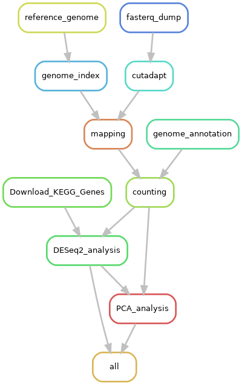

# ReproHackathon Project

Prepared by : 
- Anakim GUALDONI
- Georges HANNA
- Noémie BOZIER
- Camille DE AMORIM

# 1- Objective :
A Snakemake workflow that reproduces the results of the scientific article (https://www.nature.com/articles/s41467-020-15966-7).

# 2- Usage :
First clone the project in your repository using :  
```git clone https://github.com/CamilleDeAmorim/Reprohackathon.git```  
Then, launch the pipeline by running the following command:  
```snakemake -s Snakefile --cores <number_of_cores> --use-apptainer```

# 3 - How does it work ?
The pipeline implements a reproducible workflow for RNA-seq data analysis based on the methods described in the referenced scientific article.

<div align="center">
    
</div>

It begins by downloading raw FASTQ files using fasterq-dump (version 3.1.1) and trimming low-quality bases (below a quality score of 20) using Cutadapt (version 1.11), retaining reads with a minimum length of 25 bases. The reference genome and annotation files are downloaded in FASTA and GFF formats, respectively. 
Reads are aligned to the reference genome using Bowtie (version 0.12.7), and alignment files are processed into BAM format using Samtools (version 1.21). 

Feature counting is performed with FeatureCounts (version 1.4.6-p3). The resulting counting matrix is analyzed by differential expression analysis using R (version 3.4.1) and the DESeq2 package (version 1.16). 

The supplementary PCA analysis was performed on the samples. This analysis was conducted using R (version 4.3.1), along with the FactoMiner package (version 2.11), FactoExtra package (version 1.0.7), and ggplot2 package (version 3.5.1).

This workflow ensures reproducibility and standardization for RNA-seq data processing and analysis.

# 4- Additional notes :
To ensure reproducibility and version control of all tools, Apptainer was used to containerize the software environment. Pre-built container images are hosted in the Zenodo repository for ease of access and deployment. 
This repository includes the versions of tools used in the study, as well as newer versions that were built to enable a comparison of results between the two versions.
